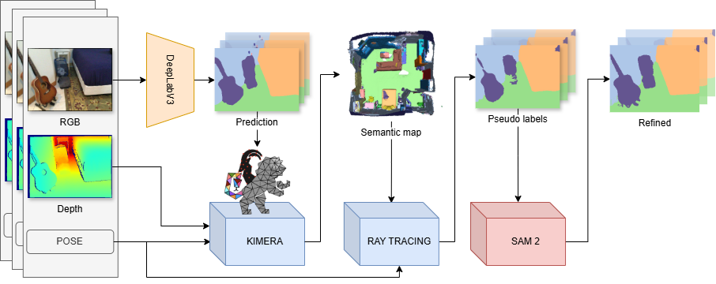

# 3D Domain Adaptation Pipeline

## Overview

This repository provides a ROS-based pipeline for unsupervised continual domain adaptation in 3D environments using ScanNet data. It includes 3D mesh reconstruction, pseudo-label generation using ray casting, label refinement via Segment Anything Model (SAM), and preparation for DeepLabV3-based semantic segmentation fine-tuning.

- 3D mesh reconstruction using **Kimera**
- Pseudo-label generation via **ray casting**
- Label refinement using **Segment Anything Model (SAM)**
- Semantic segmentation fine-tuning with **DeepLabV3**

<div style="background-color: white; display: inline-block; padding: 4px;">
  
</div>

# Installation & Setup Guide

## System Requirements

- **Operating System**: Ubuntu 20.04 (required due to ROS Noetic)
- **ROS**: Noetic
- **GPU**: CUDA-enabled GPU (tested on NVIDIA RTX 3060)
- **Python**: 3.8 (via Conda environment recommended)


## ROS Noetic Installation

Follow official instructions to install ROS Noetic:  
https://wiki.ros.org/noetic/Installation/Ubuntu

## ScanNet Dataset

We use the ScanNet dataset for this project. To download the ScanNet data and the corresponding NYU40 labels, please use this [helper repository](https://github.com/micheleantonazzi/ros_visual_datasets) and follow the instruction for the   Scannet dataset.

To simplify the integration with this repository and avoid modifying the launch files, we recommend recreating the following directory structure on your system while downloading the ScanNet dataset. This structure ensures minimal changes to the configuration files:

```
Domain_Adaptation_Pipeline/
├── IO_pipeline/
│   ├── Pipeline/
│   │   └── Output_kimera_mesh/
│   ├── PseudoLabels/
│   └── Scannet_DB/
│       └── scans/
│           ├── scene0000_00/
│           │   ├── color/
│           │   ├── deeplab_labels/
│           │   ├── deeplab_labels_colored/
│           │   ├── depth/
│           │   ├── intrinsic/
│           │   └── ...
│
└── domain.adaptation.3D(this repo)/
```

This setup provides a clean starting point and organizes the data consistently with the pipeline expectations. Further instructions on how to adjust paths in the launch files will follow in the appropriate sections.

## Conda Environment Setup

We recommend using a clean Conda environment to prevent conflicts between base and project-specific dependencies.

```bash
conda create -n domainadapt3d python=3.8
conda activate domainadapt3d
```

## Install Python Dependencies

Install the required packages inside the Conda environment:

```bash
# Conda packages
conda install -c conda-forge imageio pyyaml opencv scipy open3d
conda install pytorch torchvision torchaudio pytorch-cuda=11.8 -c pytorch -c nvidia

# Pip packages (within the conda env)
pip install catkin_pkg rospkg trimesh embreex ultralytics
```

Outside the Conda environment:

```bash
pip3 install empy==3.3.4
sudo apt install pykdl
```

Then install Catkin tools:

```bash
sudo apt install python3-catkin-tools python3-osrf-pycommon
```

## Clone the Project

```bash
git clone --recurse-submodules https://github.com/aislabunimi/domain.adaptation.3D
cd domain.adaptation.3D/catkin_ws
```

Add the project to your Python path:

```bash
export PYTHONPATH=/path/to/domain.adaptation.3D/catkin_ws/src:$PYTHONPATH
```

## Build ROS Packages

```bash
catkin build kimera_interfacer
catkin build control_node
catkin build label_generator_ros

source devel/setup.bash
```

Create NYU40-compatible DeepLabV3 predictions:

```bash
cd ../Domain_Adaptation_Pipeline/domain.adaptation.3d/TestScripts
python GenerateAllLabels.py
```

You can add '--scene=00002' and '--base_path=path/to/Domain_Adaptation_Pipeline' args to specify the scene number and the correct path.

## Generate the Pseudo Labels: Run the Full Pipeline

Before launching the full pipeline modify `catkin_ws/src/control_node/launch/start_mock.launch` to configure:

- Scene number
- Input/output paths
- Voxel size

To simulate a full scene pipeline:

```bash
roslaunch control_node start_mock.launch
```

### Batch testing
In utility you can use `BatchTesting.py`  to generate all kimera mesh pseudo and sam for all the scenes:
```bash
python3 BatchTesting.py --start 0 --end 10
```

## Notes on Protobuf

ROS is not compatible with recent versions of `protoc`. If you have a newer version installed:

```bash
sudo apt remove libprotobuf-dev protobuf-compiler
```

Install version 3.15.8 manually:

```bash
wget https://github.com/protocolbuffers/protobuf/releases/download/v3.15.8/protobuf-all-3.15.8.tar.gz
tar -xzf protobuf-all-3.15.8.tar.gz
cd protobuf-3.15.8
./configure
make -j$(nproc)
sudo make install
sudo ldconfig
```

Verify:

```bash
protoc --version
```

Also, check your Conda base environment for `libprotobuf` conflicts. Rebuild proto files in Kimera if needed:

```bash
cd catkin_ws/src/kimera_semantics_ros/include/proto/
protoc --cpp_out=. semantic_map.proto
```

## Use the Generated Labels to Fine Tune and Test Deeplab
We exported all the generated 3D MAPS and pseudo labels (both those ray traced from the 3D map and their refinements with SAM2), that can be downloaded from [here](https://unimi2013-my.sharepoint.com/:f:/g/personal/michele_antonazzi_unimi_it/EltYwy6J44dCpOaDwETSaXoB3TBCcsYfgY9kXENRK2C31A?e=EyUgQW).
Inside this, for each scene, you can find:
* The generated 3D meshes
* The generated pseudo labels obtained from the 3D voxel map. They are inside a folder named `pseudo{voxel_size}`
* The pseudo labels refined with SAM. They are inside folders name `sam{method}{imsize}{voxel}`, where
  * `method` indicates the method used to prompt SAM, `C` means prompt using pseudo labels, `A` means automatic using a grid of points
  * `imsize` indicates the size of the RGB image used by SAM. `b` is big (original size), `s` is small (320x240 pixels)
  * `voxel` is the size of the voxel size of the map from which the original labels are rendered

Furthermore, we made publicly available all the models fine tuned using our pseudo labels ([download link](https://unimi2013-my.sharepoint.com/:f:/g/personal/michele_antonazzi_unimi_it/EskwDXyxXgRBtANzO_74SyUB0UHZGzUayTMgn0HYCIAAGA?e=MK1svd)).

To test Deeplab follow these steps:

* Download the exported labels from [here](https://unimi2013-my.sharepoint.com/:f:/g/personal/michele_antonazzi_unimi_it/EltYwy6J44dCpOaDwETSaXoB3TBCcsYfgY9kXENRK2C31A?e=EyUgQW).
* For each scene, download the RGB and ground truth with the NYU40 labels following [these instructions](#scannet-dataset). Then, copy the folders with the RGB images (named `color`) and the labels (named `gt`) inside the folder of each scene. The colored images must be in the original dimension while the labels must be rescaled in 320x240. **NB: Remember to do it for each scene from 0 to 9, first and second sequence (the second sequence is not available for all scenes). All the RGB images for which the pose is corrupted/not available are discarded from pseudo label generation.**
* Download the pretrained models from [here](https://unimi2013-my.sharepoint.com/:f:/g/personal/michele_antonazzi_unimi_it/EskwDXyxXgRBtANzO_74SyUB0UHZGzUayTMgn0HYCIAAGA?e=MK1svd).
* For testing deeplab type the following commands:
  * Deeplab no fine-tuned (taken from this [repo](https://github.com/ethz-asl/ucsa_neural_rendering)), where train/test is 80/20% fo the same sequence, type `cd Finetune && python3 -m python3 -m evaluate_deeplab.evaluate_deeplab_pretrained_same_sequence`
  * Deeplab no fine-tuned (taken from this [repo](https://github.com/ethz-asl/ucsa_neural_rendering)), where train/test are different sequences of the same scene, type `cd Finetune && python3 -m python3 -m evaluate_deeplab.evaluate_deeplab_pretrained_diff_sequence`
  * Deeplab fine-tuned with view consistent pseudo labels (rendered using the voxel map), where train/test are different sequences of the same scene, type `cd Finetune && python3 -m python3 -m evaluate_deeplab.evaluate_deeplab_pretrained_diff_sequence`

## Troubleshooting

- Ensure `numpy` is not imported from the base Conda env to avoid conflicts.
- Check `PYTHONPATH` ordering if packages are not found.
- Always `source devel/setup.bash` after building or modifying any code.


> **Paper & Code References:**
> - _Unsupervised Continual Semantic Adaptation through Neural Rendering_  
>   Zhizheng Liu, Francesco Milano, Jonas Frey, Roland Siegwart, Hermann Blum, Cesar Cadena  
> - [Jonas Frey's Kimera Interfacer](https://github.com/JonasFrey96/Kimera-Interfacer)
> - [ETHZ-ASL DeepLabV3 model](https://www.research-collection.ethz.ch/handle/20.500.11850/637142)


## Citation

If you use this codebase, cite the following work:

```bibtex

```