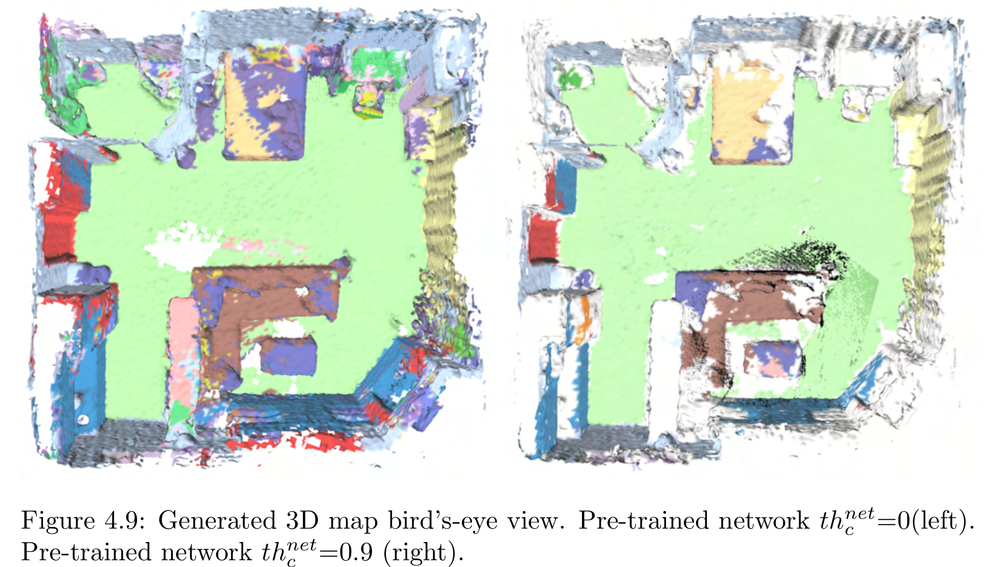

# Kimera Interfacer

Kimera Interfacer is a small wrapper around Kimera Semantics. 
We expanded Kimera Semantics with the following capabilities:
1. Exporting Voxel Volume using protobuf
2. Generating maps for individual scenes in the ScanNet dataset
3. Ray tracing pseudo labels for semantic segmentation

## Review
This fork aims to:
- Rewrite the documentation for future uses including helpfull and updated instructions for installing kimera semantics with this repo included
- Fix the static paths and more in general dl_mock.py
- Replace cv_bridge with PILbridge to avoid dependency hell

## Overview:
 
| File                            | Function                                                                                                                                                 |
| ------------------------------- | -------------------------------------------------------------------------------------------------------------------------------------------------------- |
| ```src/kimera_interfacer.cpp``` | Calls Kimera Semantics and provides the Semantic Pointcloud for integration. Exports the created map as a mesh ```.ply``` and the semantic voxel volume. |
| ```scripts/dl_mock.py```        | provides the ScanNet dataset to the correct ros-topics, by taking the images the depths and the pose with your labeled data                                                                                                   |

## Installation

This pakage is already inlcuded in the original [Kimera-Semantics by JonasFrey96](https://github.com/JonasFrey96/Kimera-Semantics)

The following instructions are an updated version of those from the original Kimera-Semantics repository. They describe how to install Kimera-Semantics using this fork of **Kimera-Interfacer**.

---

## A. Prerequisities

- Install ROS by following [our reference](./docs/ros_installation.md), or the official [ROS website](https://www.ros.org/install/).

- Install system dependencies:
```bash
sudo apt-get install python3-wstool python3-catkin-tools  protobuf-compiler autoconf
# Change `melodic` below for your own ROS distro
sudo apt-get install ros-melodic-cmake-modules
```

---

## B. Kimera-Semantics Installation

Using [catkin](http://wiki.ros.org/catkin):

```bash
# Setup catkin workspace
mkdir -p ~/catkin_ws/src
cd ~/catkin_ws/
catkin init
catkin config --extend /opt/ros/melodic # Change `melodic` to your ROS distro
catkin config --cmake-args -DCMAKE_BUILD_TYPE=Release
catkin config --merge-devel

# Add workspace to bashrc.
echo 'source ~/catkin_ws/devel/setup.bash' >> ~/.bashrc

# Clone repo
cd ~/catkin_ws/src
git clone git@github.com:JonasFrey96/Kimera-Semantics.git
```

### Modify dependences

Edit the `kimera_semantics_https.rosinstall` file located in the `install` folder:
- Replace the repository:
  ```
  https://github.com/JonasFrey96/Kimera-Interfacer
  ```
  with:
  ```
  https://github.com/SignorelliLorenzo/Kimera-Interfacer
  ```
  under the entry labeled **Kimera-Interfacer**.

Edit the `kimera_semantics_ssh.rosinstall` file in the `install` folder:
- Replace:
  ```
  git@github.com:JonasFrey96/Kimera-Interfacer.git
  ```
  with:
  ```
  git@github.com:SignorelliLorenzo/Kimera-Interfacer.git
  ```
  under the **Kimera-Interfacer** section.


### Install Dependencies with wstool

```bash
# Initialize wstool (only if not already initialized)
wstool init

# Merge the desired rosinstall file:
# For SSH:
wstool merge Kimera-Semantics/install/kimera_semantics_ssh.rosinstall
# For HTTPS:
#wstool merge Kimera-Semantics/install/kimera_semantics_https.rosinstall


# Download and update all dependencies
wstool update
```

### Build the Package

```bash
# Compile code
catkin build kimera_semantics_ros

# Refresh workspace
source ~/catkin_ws/devel/setup.bash
```

---

## C. Tips & Troubleshooting

### Catkin Workspace Previously Built with `catkin_make`
If your workspace was previously built using `catkin_make`, `catkin build` may not work. To resolve this:
```bash
cd ~/catkin_ws
rm -rf build/ devel/
catkin config --extend /opt/ros/<your-ros-distro>  # e.g., noetic
catkin build
```

### Python3 Empy Issue
If you encounter issues related to `python3-empy`, try installing version 3.3.4:
```bash
pip3 install empy==3.3.4
```
If you had previously installed Empy via:
```bash
sudo apt install python3-empy
```
or others, you should remove it, as it may cause compatibility issues:
```bash
sudo apt remove python3-empy
```
After reinstalling with `pip3`, if the build still fails, try cleaning your workspace again:
```bash
rm -rf build/ devel/
```

### PCL or Similar Errors
If you run into issues with PCL or related packages:
```bash
rm -rf src/ros_perception  # Remove the ros_perception folder in src
sudo apt install ros-noetic-pcl-ros ros-noetic-pcl-conversions
catkin build
```

## D. Configuration

Create a directory to store the generated labels, or point to an existing one containing labeled images. The input images can be RGBA, 8-bit grayscale, or 16-bit grayscale.

```bash
mkdir {Your scannet scene dir}/generated_labels
```

New pseudo-labels will be saved in this directory, organized by a unique identifier (`idtf`):
```
../labels_generated/idtf/scans/scene0000_00/idtf/*.png
```

These labels are stored in PNG format using the top 3 class probabilities to reduce memory usage.

### Launch Configuration
Before launching the pipeline, edit the configuration file:
```
Kimera-Interfacer/kimera_interfacer/launch/predict_generic_scene.launch
```
to reflect paths on your system. Important parameters include:
```yaml
output_dir:             # Path to export mesh and semantic map data
mapping_scannet_path:   # Path to scannetv2-labels.combined.tsv file
label_scene_base:       # Directory where your predictions are stored inside the ScanNet dataset
scannet_scene_base:     # Path to ScanNet scans folder (e.g., /scannet/scans)
fps:                    # rospy rate — avoid setting too high to prevent freezing
root_scannet:           # Root path of your ScanNet database (e.g., /scannet)
```

---

## E. Quickstart

Start the ROS core service:
```bash
roscore
```

Then, in a separate terminal, launch RViz:
```bash
cd ~/catkin_ws/src
rviz -d Kimera-Interfacer/kimera_interfacer/rviz/dl_mock_scene0000_00.rviz
```

To generate maps for multiple scenes:
```bash
cd ~/catkin_ws/src/Kimera-Interfacer/kimera_interfacer/scripts
python3 generate_maps.py --exp="ASL/cfg/exp/some_run.yml"
```

The `exp` YAML files are located in the [Main Repository](https://github.com/JonasFrey96/ASL) and specify which `idtf` to use for exporting predictions from the trained network.

### Creating an exp YAML File

Here's an example YAML configuration:
```yaml
generate_maps:
  certainty_thershold: 0.5         # Certainty threshold for integrating labels into the map
fps: 2                           # Frame rate for map generation
voxel_size: 0.05                 # Voxel resolution
label_identifier_out: labels_out # Output label name
sub_reprojected: 2               # Ray tracing sub-sampling (see paper)
parallel: True                   # Enables parallel processing of multiple maps
label_generation:                # Configuration for prediction generation
  active: True
  identifier: create_labels      # Output identifier name
  confidence: 0                  # Always set to 0
  scenes:                        # List of scenes to generate labels for
    - scene0000_00                
    - scene0000_01
    - scene0000_02
```

---

## Additional Tips

If launching the mesh reader fails or crashes, try building the Kimera-Interfacer package individually:
```bash
catkin build kimera_interfacer
```

### Scene Generation Note

When generating scenes, make sure to check the static scene addresses in the following files or in others:

- `Kimera-Interfacer/kimera_interfacer/launch/predict_generic_scene.launch`
- `Kimera-Interfacer/kimera_interfacer/scripts/predict_generic_scene.launchlabel_loader.py`

This ensures that the correct scene configurations are being loaded and avoids potential mismatches or errors during prediction.


## Demo Mapping:

 
Changing the ```generate_maps/certainty_thershold```:
<p align="center">
 
</p>
 
## Generating Pseudo Labels (Ray traying)
 
Activate correct python environment with all packages installed for ray tracing ([Main repository](https://github.com/JonasFrey96/ASL))
 
```bash
conda activate cl
python scrips/generate_labels.py --exp="ASL/cfg/exp/some_run.yml"
```
 
It will output a new folder in the label_scene_base directory with the set label_identifier_out name.

## NOTES
I am publishing this after 16 hours of work. I will give you a short summary of what i did, this projects also has a lot of python modules that have problems, or that are not specifyed in particular PyKDL, that you have to build from source in you ros ws.
- Modifyed dl-mock adding the scannet_root param
- Removed cv2_bridge from dl-mock and used homemade PILBridge
- Modified the path were the generated_labels are searched and made it so that it serches them inside the scannet scene folder
- Minor tweaks and suppression of warnings, added progress and a bit of debug.

